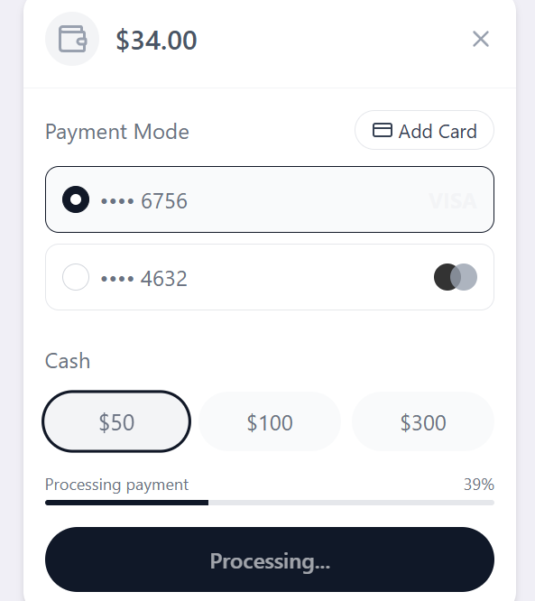
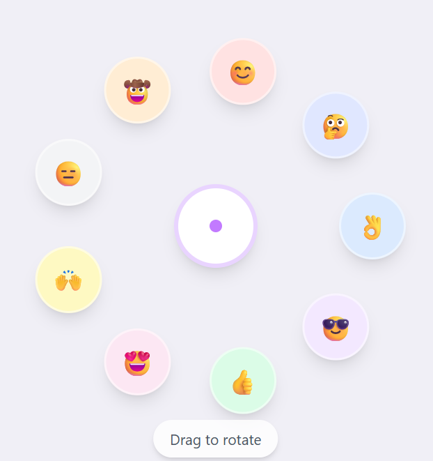
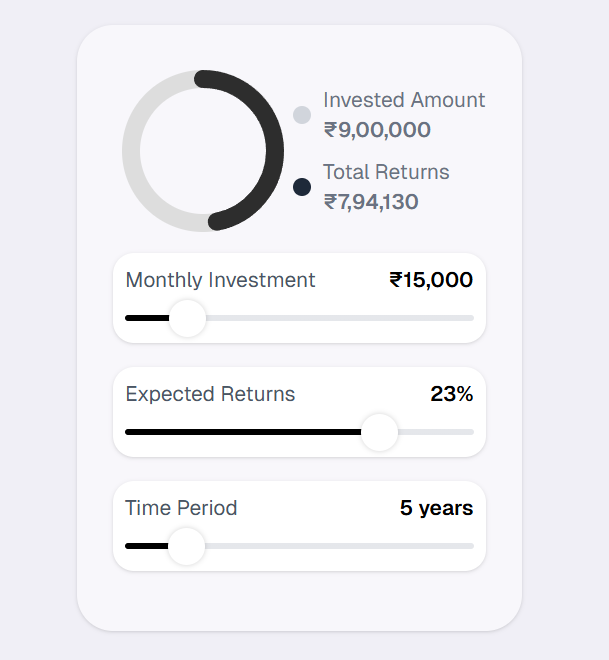
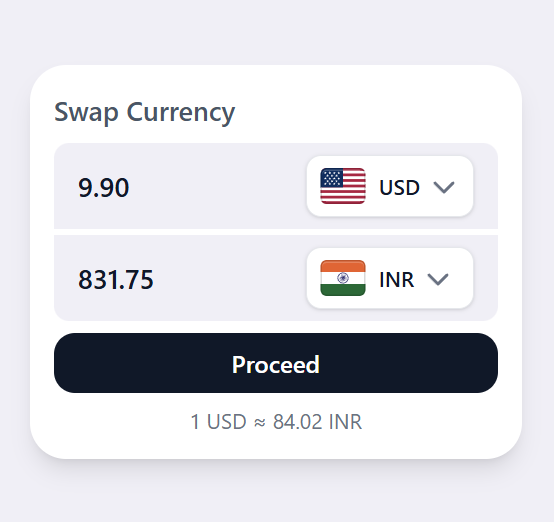

# UIForge  

✨ **UIForge** is a collection of custom UI components built to demonstrate **UI/UX design**, **styling**, and **interactive experiences**.  
Inspired by design concepts from platforms like **Dribbble** and similar sources, this repo serves as a playground for experimenting with modern frontend development.  

---

## 🚀 Tech Stack  
- **[Next.js](https://nextjs.org/)** – React framework for fast, scalable web apps  
- **[TypeScript](https://www.typescriptlang.org/)** – Static typing for maintainable code  
- **[Tailwind CSS](https://tailwindcss.com/)** – Utility-first CSS for rapid UI development  
- **[Framer Motion](https://www.framer.com/motion/)** – Smooth animations and micro-interactions  

---

## 🎨 Features  
- Clean, reusable **UI components**  
- Focus on **aesthetic design** and **micro-interactions**  
- Inspired by **modern UI trends** (Dribbble, Behance, etc.)  
- Perfect for learning and experimenting with **UI prototyping**  

---

## 🖼️ Preview  

Here are some example components from **UIForge**:  

|---------------------|-----------------|
|  |  |

|  |  |

---

## ⚡ Getting Started
- Clone the repo and install dependencies:
```
git clone https://github.com/luckygoyal039/UIForge.git
cd UIForge
npm install
```
- Run the development server:
  ```npm run dev```

---
## 🤝 Contributing
- Contributions are welcome! Feel free to fork this repo and submit PRs with improvements, new components, or bug fixes.
---
